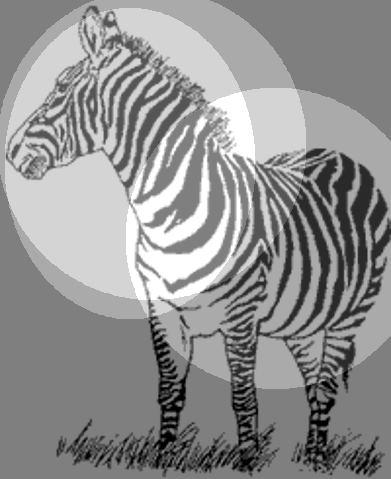
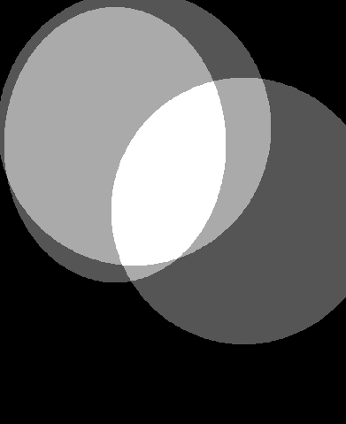

# Non-strict Attentional Region Annotation for Harvesting Image Databases

[日本語](README-jp.md)

This dataset is Non-strict Attentional Region Annotation (NARA) for a generic image dataset, [Harvesting Image Databases](https://www.robots.ox.ac.uk/~vgg/data/mkdb/index.html).

NARA is non-strict annotation with a simple shape (an ellipse) to show region about where the annotator focused their attention when classifying categories.
With simple operations, The location where human attended on recognition can be recorded and used to improve the accuracy of classification models.



For details of the method, please refer to the following published papers.

> Satoshi Arai, Shinichi Shirakawa, and Tomoharu Nagao,
> "Improvement of Generic Image Classification Accuracy via Convolutional Neural Networks with Non-strict Attentional Region Annotation"(in Japanese),
> FIT 2024.

> Satoshi Arai, Shinichi Shirakawa, and Tomoharu Nagao,
> "Non-strict Attentional Region Annotation to Improve Image
> Classification Accuracy," IEEE SMC 2021.

## Image dataset

The image dataset used as the basis for annotation can be downloaded from the [Harvesting Image Databases](https://www.robots.ox.ac.uk/~vgg/data/mkdb/index.html) site.

Download the zip file of the 18 classes listed in *18 Object-Class Databases* and extract it to a suitable location.
It also contains metafiles other than image files, but we will not use these.

Because Harvesting Image Databases are based on images collected by searching the web, they contain inappropriate images that do not fit the corresponding category.
Such images are excluded by hand at the original dataset stage and skipped from our annotation targets.
The file names of the images that were actually annotated are listed in the *Image* column of [harvestingdb_nara.csv](harvestingdb_nara.csv).

## Annotation results

The annotation results are recorded in [harvestingdb_nara.csv](harvestingdb_nara.csv), with each line corresponding to one annotation.
This file records the position and size of the ellipse markers at the time of annotation as numerical data.
Since three different workers annotated on the same image, three consecutive lines constitute one set.

This file is tabular data recorded in CSV format, with the following information recorded in each column.

| Column name | Contents |
|:-|:-|
| WorkTimeInSeconds | Annotation time (Seconds for category classification and region annotation combined). |
| Image | Image filename (Folder name part indicates correct category). |
| Answer.anno_angle | Ellipse marker angle (in radians). |
| Answer.anno_centx, Answer.anno_centy | Ellipse marker center position. |
| Answer.anno_imght, Answer.anno_imgwd | Image size (in pixel). |
| Answer.anno_scale | The scale at which the image is presented for annotation. |
| Answer.anno_sizex, Answer.anno_sizey | Ellipse marker radius. |
| Answer | Category classification by annotators, which may differ from the correct category. |

## Script for annotation map generation

The annotation results are recorded as numerical data such as the position and size of the ellipse markers, so it is expected that they will be converted into two-dimensional images for actual use.
We provide [draw_annotation_maps.py](draw_annotation_maps.py) as a script that performs this conversion.

After installing the necessary packages according to requirements.txt, run the following command.
An annotation map will be generated under the *maps* folder.

```python
python draw_annotation_maps.py --input_name harvestingdb_nara.csv --output_dir maps
```



## Notes

The following image file contain corrupted data.
Some image loader crash on loading the image, so please exclude it as appropriate.
(For example, an error will occur if you try to load it with PIL.)

- bike/img_f1998e4035c3c9e73a7f5e29b98cb3e0efc2603d.png

## License

The use of this annotation result is subject to the [LICENSE](LICENSE.txt).

For image data included in the Harvesting Image Databases, please refer to the original [LICENSE](https://www.robots.ox.ac.uk/~vgg/data/mkdb/LICENSE.TXT).

## Acknowledgements

This result is based on results obtained from a project,
JPNP20001221-0, commissioned by the New Energy and Industrial
Technology Development Organization (NEDO).
